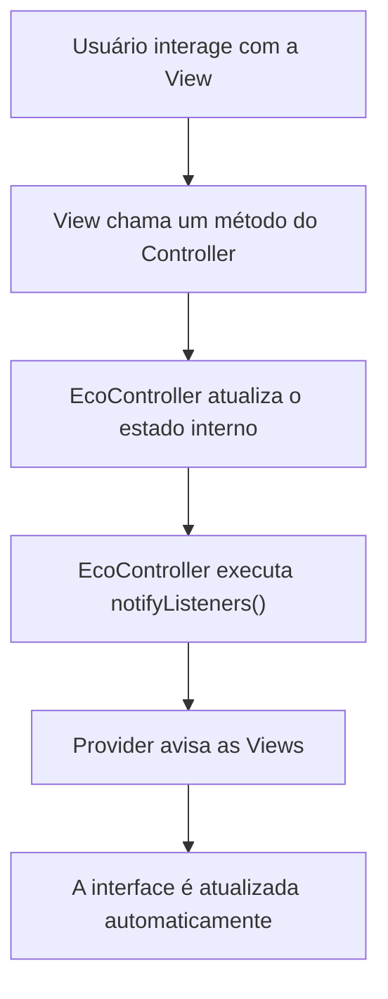
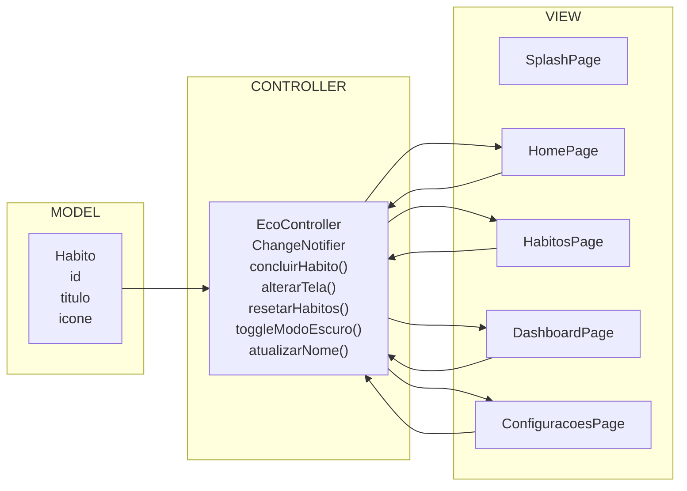

# EcoTrack – Controle de Hábitos Sustentáveis

**Especificação dos Requisitos de Software (SRS)**  
Estrutura baseada na **ISO/IEC/IEEE 29148:2018**

---

## 1. Identificação do Documento

| Campo | Valor |
|---|---|
| Projeto | EcoTrack – Controle de Hábitos Sustentáveis |
| Versão | 1.0.0 |
| Data | 2026-04-28 |
| Autor | Luan Basani |
| Instituição | SENAI Americana – ADS |
| Disciplina | Desenvolvimento Mobile com Flutter |

---

## 2. Introdução

### 2.1 Propósito

Este documento descreve os requisitos do projeto **EcoTrack**, um aplicativo mobile desenvolvido em Flutter com uso do pacote **Provider** para gerenciamento de estado.

O objetivo deste documento é apresentar o que o sistema deve fazer, como ele deve funcionar, quais telas serão desenvolvidas e como o projeto será organizado usando a modelagem **MVC**.

### 2.2 Escopo

O **EcoTrack** é um aplicativo voltado para pessoas que desejam acompanhar hábitos sustentáveis no dia a dia.

O sistema permitirá ao usuário:

- visualizar hábitos sustentáveis pendentes;
- marcar hábitos como concluídos;
- acompanhar metas semanais;
- visualizar um resumo do impacto positivo no dashboard;
- configurar preferências, como tema escuro e nome de usuário;
- redefinir o progresso dos hábitos.

O aplicativo será desenvolvido como um protótipo funcional para fins acadêmicos, seguindo os requisitos da Situação de Aprendizagem Somativa.

### 2.3 Acrônimos e Siglas

| Sigla | Significado |
|---|---|
| SRS | Software Requirements Specification |
| ADS | Análise e Desenvolvimento de Sistemas |
| SA | Situação de Aprendizagem |
| UI | User Interface |
| MVC | Model-View-Controller |

### 2.4 Visão Geral

Este documento está organizado da seguinte forma:

- **Seção 3:** descrição geral do sistema;
- **Seção 4:** requisitos funcionais;
- **Seção 5:** requisitos não funcionais;
- **Seção 6:** uso do Provider;
- **Seção 7:** estrutura do projeto em MVC;
- **Seção 8:** modelagem MVC;
- **Seção 9:** protótipos das telas em média fidelidade;
- **Seção 10:** considerações finais.

---

## 3. Descrição Geral

### 3.1 Contexto do Produto

O **EcoTrack** é um aplicativo mobile standalone, ou seja, não depende de servidor externo para funcionar.

O estado da aplicação será gerenciado localmente durante a execução do app, utilizando o **Provider** com `ChangeNotifier`.

Como o projeto segue a modelagem **MVC**, o Provider será usado dentro da camada **Controller**, centralizando a lógica e o controle de estado da aplicação.

### 3.2 Funções Principais

O aplicativo terá as seguintes funções principais:

- apresentar o aplicativo em uma tela inicial;
- exibir uma lista de hábitos sustentáveis pendentes;
- permitir que o usuário conclua hábitos;
- mover hábitos concluídos para uma aba separada;
- exibir um dashboard com informações atualizadas;
- permitir alterações na tela de configurações;
- controlar a navegação entre telas;
- atualizar a interface automaticamente usando Provider.

### 3.3 Usuários

O aplicativo é voltado para qualquer pessoa que queira melhorar seus hábitos sustentáveis.

O usuário não precisa ter conhecimento técnico para utilizar o sistema.

### 3.4 Restrições Técnicas

- O aplicativo deve ser desenvolvido em Flutter;
- O gerenciamento de estado deve ser feito com Provider;
- O projeto deve seguir a organização MVC;
- Os dados serão mantidos apenas em memória durante a execução;
- A interface deve ser responsiva;
- O aplicativo deve conter pelo menos 3 telas;
- O aplicativo deve utilizar widgets estruturais como `Scaffold`, `AppBar`, `Drawer`, `BottomNavigationBar`, `TabBarView`, `GridView` e `ListView`.

### 3.5 Dependências

| Dependência | Finalidade |
|---|---|
| Flutter SDK 3.x | Desenvolvimento do aplicativo mobile |
| provider: ^6.1.2 | Gerenciamento de estado |

---

## 4. Requisitos Funcionais

> Requisitos funcionais descrevem o que o sistema deve fazer.

---

### RF01 – Tela Inicial

O aplicativo deve exibir uma tela inicial de apresentação contendo:

- nome do aplicativo;
- breve descrição da proposta;
- ícone ou ilustração relacionada à sustentabilidade;
- botão para acessar a aplicação.

**Critério de aceitação:** ao clicar no botão **Começar**, o usuário deve ser direcionado para a tela principal do aplicativo.

---

### RF02 – AppBar

A tela principal deve possuir uma `AppBar` contendo:

- título do aplicativo;
- ícone de menu;
- ícone de notificação;
- indicador de pontuação sustentável.

**Critério de aceitação:** a `AppBar` deve aparecer nas telas principais do aplicativo.

---

### RF03 – Drawer

O aplicativo deve possuir um menu lateral com links para:

- Dashboard;
- Hábitos;
- Configurações;
- Ajuda.

**Critério de aceitação:** ao clicar nos itens principais do Drawer, a tela correspondente deve ser exibida.

---

### RF04 – BottomNavigationBar

O aplicativo deve possuir uma barra de navegação inferior com pelo menos 3 opções:

- Dashboard;
- Hábitos;
- Configurações.

**Critério de aceitação:** a troca de telas deve ser controlada pelo `EcoController`.

---

### RF05 – Tela de Hábitos com TabBarView

A tela de hábitos deve conter duas abas usando `TabBarView`.

#### Aba 1 – Hábitos Pendentes

A aba de hábitos pendentes deve exibir uma lista com hábitos ainda não realizados, como:

- Separar lixo reciclável;
- Economizar água no banho;
- Usar garrafa reutilizável;
- Desligar luzes desnecessárias;
- Usar transporte coletivo ou bicicleta.

Cada item deve possuir um botão para marcar o hábito como concluído.

#### Aba 2 – Hábitos Concluídos

A aba de hábitos concluídos deve exibir os hábitos que já foram marcados como realizados.

**Critério de aceitação:** ao marcar um hábito como concluído, ele deve sair da lista de pendentes e aparecer na lista de concluídos.

---

### RF06 – Dashboard Ambiental

A tela de dashboard deve apresentar um resumo visual das ações sustentáveis do usuário, usando cards organizados em `GridView`.

Os cards devem exibir informações como:

- hábitos concluídos;
- hábitos pendentes;
- pontuação ecológica;
- meta semanal;
- nível atual do usuário;
- impacto estimado.

**Critério de aceitação:** os dados do dashboard devem ser atualizados automaticamente quando o usuário concluir hábitos.

---

### RF07 – Tela de Configurações

A tela de configurações deve permitir que o usuário altere preferências do aplicativo.

A tela deve conter opções como:

- ativar ou desativar modo escuro;
- alterar o nome do usuário;
- limpar hábitos concluídos;
- redefinir progresso.

**Critério de aceitação:** pelo menos uma configuração deve alterar o estado global do aplicativo usando o `EcoController`.

---

### RF08 – Atualização de Estado com Provider

O aplicativo deve atualizar suas informações automaticamente quando houver mudanças no estado.

As mudanças podem ocorrer quando o usuário:

- conclui um hábito;
- muda de tela;
- ativa ou desativa o modo escuro;
- altera o nome;
- redefine o progresso.

**Critério de aceitação:** as telas devem ser atualizadas após o uso de `notifyListeners()` no `EcoController`.

---

## 5. Requisitos Não Funcionais

> Requisitos não funcionais descrevem como o sistema deve se comportar.

| ID | Requisito |
|---|---|
| RNF01 | **Responsividade:** a interface deve se adaptar a diferentes tamanhos de tela |
| RNF02 | **Desempenho:** as atualizações de estado devem acontecer de forma rápida após as ações do usuário |
| RNF03 | **Organização:** o projeto deve ser separado nas pastas `model`, `view` e `controller`, seguindo MVC |
| RNF04 | **Legibilidade:** o código deve possuir nomes claros para classes, variáveis e métodos |
| RNF05 | **Comentários:** o código deve conter comentários explicativos nos principais trechos |
| RNF06 | **Reutilização:** os elementos visuais devem ser organizados para evitar repetição desnecessária |
| RNF07 | **Usabilidade:** a interface deve ser simples e fácil de entender |
| RNF08 | **Manutenibilidade:** a estrutura do projeto deve facilitar alterações futuras |

---

## 6. Uso do Provider

O pacote **Provider** será utilizado para controlar o estado global da aplicação.

Neste projeto, o Provider ficará dentro da camada **Controller**, representado pelo arquivo `ecoController.dart`.

### 6.1 Responsabilidades do EcoController

| Responsabilidade | Método / Atributo |
|---|---|
| Armazenar lista de hábitos pendentes | `habitosPendentes` |
| Armazenar lista de hábitos concluídos | `habitosConcluidos` |
| Marcar hábito como concluído | `concluirHabito(Habito habito)` |
| Calcular quantidade de hábitos realizados | `habitosConcluidos.length` |
| Calcular pontuação ecológica | `pontuacao` |
| Calcular meta semanal | `metaSemanal` |
| Calcular nível do usuário | `nivel` |
| Calcular impacto estimado | `impacto` |
| Atualizar dados do dashboard | `notifyListeners()` |
| Controlar tela selecionada no BottomNavigationBar | `telaSelecionada` e `alterarTela(int index)` |
| Controlar tema claro/escuro | `modoEscuro` e `toggleModoEscuro()` |
| Atualizar nome do usuário | `atualizarNome(String nome)` |
| Redefinir progresso | `resetarHabitos()` |

### 6.2 Exemplo de Implementação

```dart
class EcoController extends ChangeNotifier {
  int telaSelecionada = 0;

  void alterarTela(int index) {
    telaSelecionada = index;
    notifyListeners();
  }

  void concluirHabito(Habito habito) {
    habitosPendentes.remove(habito);
    habitosConcluidos.add(habito);
    notifyListeners();
  }
}
```

---

## 7. Estrutura do Projeto

O projeto será organizado seguindo o padrão **MVC**, separando os arquivos em **Model**, **View** e **Controller**.

```text
lib/
├── main.dart
├── controller/
│   └── ecoController.dart
├── model/
│   └── habito.dart
└── view/
    ├── splashPage.dart
    ├── homePage.dart
    ├── dashboardPage.dart
    ├── habitosPage.dart
    └── configuracoesPage.dart
```

### 7.1 Model

A camada **Model** é responsável por representar os dados do sistema.

No EcoTrack, o arquivo `habito.dart` representa um hábito sustentável, contendo informações como:

- id;
- título;
- ícone.

### 7.2 View

A camada **View** é responsável pelas telas e pela interface visual do aplicativo.

No EcoTrack, as telas ficam dentro da pasta `view`.

Arquivos da camada View:

- `splashPage.dart`;
- `homePage.dart`;
- `dashboardPage.dart`;
- `habitosPage.dart`;
- `configuracoesPage.dart`.

### 7.3 Controller

A camada **Controller** é responsável pela lógica do sistema e pelo gerenciamento de estado.

No EcoTrack, o arquivo `ecoController.dart` usa o Provider com `ChangeNotifier` para controlar:

- hábitos pendentes;
- hábitos concluídos;
- pontuação ecológica;
- troca de telas;
- modo escuro;
- nome do usuário;
- reset do progresso.

---

## 8. Modelagem MVC

O projeto EcoTrack utiliza o padrão **MVC** adaptado ao Flutter.

| Camada | Pasta | Responsabilidade |
|---|---|---|
| Model | `model/` | Representa os dados do sistema |
| View | `view/` | Exibe as telas e captura interações do usuário |
| Controller | `controller/` | Controla a lógica, o estado e as ações do usuário |

### 8.1 Model

```text
Habito
──────────────────
id      : String
titulo  : String
icone   : String
```

### 8.2 Controller

```text
EcoController extends ChangeNotifier
────────────────────────────────────
Atributos:
  habitosPendentes  : List<Habito>
  habitosConcluidos : List<Habito>
  telaSelecionada   : int
  modoEscuro        : bool
  nomeUsuario       : String

Métodos:
  concluirHabito(Habito)  → move pendente para concluído
  alterarTela(int)        → troca tela no BottomNavigationBar
  resetarHabitos()        → restaura todos os hábitos
  toggleModoEscuro()      → alterna tema claro/escuro
  atualizarNome(String)   → atualiza nome do usuário
```

### 8.3 View

```text
SplashPage
HomePage
DashboardPage
HabitosPage
ConfiguracoesPage
```

### 8.4 Fluxo de Dados



### 8.5 Diagrama MVC



---

## 9. Protótipos das Telas em Média Fidelidade

Os protótipos das telas do aplicativo **EcoTrack** foram desenvolvidos no Figma, com foco em representar a estrutura visual e a navegação principal do sistema.

**Link do protótipo no Figma:**  
[Protótipo EcoTrack – Figma](https://www.figma.com/design/4Kihm9UtPZ7a5D9i3CSw4F/EcoTrack-%E2%80%93-Prot%C3%B3tipos-M%C3%A9dia-Fidelidade?node-id=0-1&t=vpiYnxKbNoGVbmrN-1)

As telas foram organizadas com base nos widgets solicitados na Situação de Aprendizagem, como:

- `Scaffold`;
- `AppBar`;
- `Drawer`;
- `BottomNavigationBar`;
- `TabBarView`;
- `ListView`;
- `GridView`.

### 9.1 Tela Inicial – Splash Page

A tela inicial apresenta o nome do aplicativo, uma ilustração relacionada à sustentabilidade, uma breve descrição da proposta do app e um botão para acessar a aplicação.

Elementos representados:

- nome do aplicativo;
- ícone relacionado ao meio ambiente;
- texto de apresentação;
- botão **Começar**.

### 9.2 Tela de Hábitos Sustentáveis

A tela de hábitos permite ao usuário visualizar ações sustentáveis pendentes e marcá-las como concluídas.

Elementos representados:

- AppBar com título do aplicativo;
- ícone de menu;
- indicador de pontuação;
- abas de hábitos pendentes e concluídos;
- lista de hábitos usando `ListView`;
- botão para concluir cada hábito;
- BottomNavigationBar.

### 9.3 Tela Dashboard Ambiental

A tela de dashboard apresenta um resumo visual do progresso sustentável do usuário.

Elementos representados:

- total de hábitos concluídos;
- hábitos pendentes;
- pontuação ecológica;
- meta semanal;
- nível atual do usuário;
- impacto estimado;
- cards organizados em `GridView`;
- BottomNavigationBar.

### 9.4 Tela de Configurações

A tela de configurações permite alterar preferências do aplicativo e gerenciar o progresso do usuário.

Elementos representados:

- modo escuro;
- nome do usuário;
- limpar hábitos concluídos;
- redefinir progresso;
- BottomNavigationBar.

---

## 10. Considerações Finais

O projeto **EcoTrack** foi planejado para atender aos requisitos da Situação de Aprendizagem Somativa, utilizando Flutter, Provider, MVC e widgets estruturais.

A documentação apresenta os requisitos funcionais, os requisitos não funcionais, a organização do projeto, a modelagem MVC e os protótipos de média fidelidade.

O objetivo principal é criar um aplicativo simples, funcional e organizado, adequado ao nível de desenvolvimento de um estudante em processo de aprendizagem.

---

*Documento elaborado para fins acadêmicos – SENAI Americana, Situação de Aprendizagem Somativa – Flutter com Provider.*
